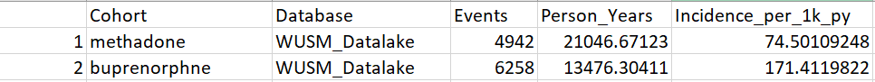

```{r setup, include=FALSE}
# library(LegendT2dm)
knitr::opts_chunk$set(echo = TRUE, warning=FALSE)
options(kableExtra.latex.load_packages = FALSE)
library(kableExtra)
library(dplyr)
options(readr.show_col_types = FALSE)
options(knitr.kable.NA = "")
options(knitr.table.format = function() {
  if (knitr::is_latex_output()) {
    "latex"
  } else if (knitr::is_html_output()) {
    "html"
  } else {
    "pipe"
  }
})

latex_table_font_size <- 8
```

# List of Abbreviations

```{r abbreviations, echo=FALSE}
abbreviations <- readr::read_delim(col_names = FALSE, delim = ":", trim_ws = TRUE, file = "
OUD: opioid use disorder

ER: emergency room

ED: emergency department

ICD: International Classification of Diseases

OHDSI: Observational Health Data Sciences and Informatics

OMOP: Observational Medical Outcomes Partnership

CDM: common data model

PS: propensity score

EHR: electronic health record

IRB: Institutional Review Board

WUSM: Washington Univeristy School of Medicine

")

tab <- kable(abbreviations, col.names = NULL, linesep = "", booktabs = TRUE)

if (knitr::is_latex_output()) {
  tab %>% kable_styling(latex_options = c("striped", "hold_position"), 
                        font_size = latex_table_font_size)
} else {
  tab %>% kable_styling(bootstrap_options = "striped")
}
```

\clearpage

# Responsible Parties

## Investigators

```{r parties, echo=FALSE}
parties <- readr::read_delim(col_names = TRUE, delim = ";", trim_ws = TRUE, file = "
  Investigator; Institution/Affiliation
  Linying Zhang, PhD *; I2DB, Washington Universiry School of Medicine, St. Louis, MO, USA
  Ruochong Fan, MA; I2DB, Washington Universiry School of Medicine, St. Louis, MO, USA
")

tab <- kable(parties, booktabs = TRUE, linesep = "") %>%
  column_spec(1, width = "10em") %>%
  column_spec(2, width = "35em") %>%
  footnote(general = "* Principal Investigator", general_title = "")

if (knitr::is_latex_output()) {
  tab %>% kable_styling(latex_options = c("striped", "hold_position"),
                        font_size = latex_table_font_size)
} else {
  tab %>% kable_styling(bootstrap_options = "striped")
}
```

## Disclosures

This study is undertaken within Observational Health Data Sciences and Informatics (OHDSI), an open collaboration.

\clearpage

# Abstract

**Background and Significance**: The opioid epidemic is a complex public health crisis that disproportionately affects diverse populations across the United States. In Missouri, over 70% of drug overdose deaths in 2022 involved opioids. Pharmacological treatments are effective for lowering the risk of opioid use disorder (OUD) and opioid overdose based on trial results. However, OUD and opioid overdose treatments are highly underutilized with limited real-world evidence, especially the heterogeneity of treatment responses across patient populations and their effectiveness on reducing opioid-related healthcare utilization.

**Study Aims**: This study aims to compare the real-world effectiveness of pharmacological treatments (i.e., methadone vs. buprenorphine) on the risk of OUD or opioid overdose related emergency department (ED) visit or hospitalization among patients with OUD or opioid overdose. 

**Study Description**: We used a retrospective comparative cohort design.

* **Population**: Patients aged 16 years or above diagnosed with OUD or opioid overdose and treated with methadone (target) or buprenorphine (comparator) were included.

* **Comparators**: Patients with at least one condition of OUD or opioid overdose at least 1 day prior to first exposure and has a MOUD exposure (methadone or buprenorphine) during an inpatient, ER, or inpatient ER visit are included in the treatment or comparator cohort. Patients were censored if they switched to alternative treatments or no longer observed in the database (loss to follow up).

* **Outcomes**: The main outcome is OUD or opioid overdose related ED visit or hospitalization. We also include two sub-outcomes, OUD only ED visits or hospitalization and opioid overdose only ED visits or hospitalization, for comparison. 
  
* **Design**: Retrospective comparative cohort design of electronic health record (EHR) data in the OHDSI network.

**Methods**: Patients receiving the methadone are compared to propensity score matched patients receiving buprenorphine. We deployed the large-scale propensity score method to adjust for 41,202 pre-treatment covariates. We then apply the Cox model to compare the treatment effect between patients who received methadone with patients who received buprenorphine. 

**Conclusions**: Knowing the real-world treatment effect of two commonly used MOUD on OUD or opioid overdose will contribute to safer medication selection for opioid doctors.

\clearpage

# Amendments and Updates

```{r amendments, echo=FALSE}
amendments <- readr::read_delim(col_names = TRUE, delim = ";", trim_ws = TRUE, file = "
  Number; Date; Section of study protocol; Amendment or update; Reason
")

tab <- kable(amendments, booktabs = TRUE, linesep = "")

if (knitr::is_latex_output()) {
  tab %>% kable_styling(latex_options = c("striped", "hold_position"), font_size = latex_table_font_size)
} else {
  tab %>% kable_styling(bootstrap_options = "striped")
}
```

# Milestones

```{r dates, echo=FALSE}
dates <- readr::read_delim(col_names = TRUE, delim = ";", trim_ws = TRUE, file = "
  Milestone; Planned / actual date
•	Call for data partners; May-21, 2024 / May-21, 2024
")

tab <- kable(dates, booktabs = TRUE, linesep = "")

if (knitr::is_latex_output()) {
  tab %>% kable_styling(latex_options = c("striped", "hold_position"), font_size = latex_table_font_size)
} else {
  tab %>% kable_styling(bootstrap_options = "striped")
}
```

# Rationale and Background

# Study Objectives

The overall objective of the study is to estimate the comparative effectiveness of reducing healthcare visits (inpatient, ER, or inpatient ER visits) associated with MOUD exposure in patients with OUD or opioid overdose. To address our hypothesis, we propose the following question: 

- Is methadone more effective in reducing inpatient, ER, or inpatient ER visits relative to buprenorphine in patients with OUD or opioid overdose?

# Research Methods

## Study Design

The study uses a retrospective comparative cohort design. The patients are matched 1:1 using propensity scores estimated by large-scale propensity score with 41,202 pre-treatment covariates to adjust for confounding. The data are from Barnes Jewish HealthCare (BJC), including 14 EHR databases from hospitals in the St. Louis metro area. The data were standardized to the OMOP common data model v5.3. For the network study, data sources will be administrative claims or electronic health record (EHR) data across the OHDSI network.## Data Sources

## Study Population

Patients aged 16 years or above diagnosed with OUD or opioid overdose and treated with methadone (target) or buprenorphine (comparator) are included. The outcome is OUD or opioid overdose related ED visit or hospitalization. Patients were censored if they switched to alternative treatments or no longer observed in the database (loss to follow up).

## Exposure Comparators

Figure 1: Exposure cohort definition using methadone as the example.


## Outcomes {#outcomes}

The outcome is at least one OUD or opioid overdose related condition during an inpatient, ER, or inpatient ER visit. 

## Covariates
We deployed the large-scale propensity score method that adjusted for a comprehensive range (41,202 covariates in WUSM database) of baseline characteristics. 

## Negative controls

Negative controls will be picked to represent exposure-outcome pairs where no causal effect is expected to exist. 

# Data Analysis Plan

## General

Although the primary aim of this study is a comparative safety study, various standardized analytics available in the OHDSI community will be applied. The Strategus pipeline will be used to call various packages in the HADES library for A) data characterization (A1-cohort diagnostics, A2-cohort features, A3-incidence rates, A4-time-to-event), B) patient-level prediction, and C) population-level effect estimation (C1-comparative cohort). 

## A) Data Characterization

### A1) Cohort Diagnostics

This step used the R package CohortDiagnostics on the target, comparator, and outcome cohorts to develop and evaluate phenotype algorithms. The cohort diagnostics functions include cohort counts, incidence rate, time distribution, concepts includes, and results comparison between multiple databases. 

### A2) Cohort Features

The Characterization and FeatureExtraction packages are used to identify features of patients in each exposure group who had the outcome and those who did not have the outcome. This step will generate results like dechallenge-rechallenge analyses, time-to-event analyses, and aggregate covariates analyses. 

### A3) Incidence Rates

As stated above, this step uses CohortDiagnostics package to calculate the incidence rates for the target (methadone) and comparator (buprenorphine) cohort. The rate is calculated as the number of new cases within the time-at-risk period over the number of total person-years. 

An example of incidence rate table using data from WUSM OMOP CDM is shown below: 

Figure 2: Incidence rate table using WUSM_Datalake as an example.


Incidence rates can be stratified by gender, age, and index year subgroups using the Shiny interactive app from the CohortDiagnostics package.

#### Calculation of time-at-risk

The time at risk window for WUSM_Datalake patients are calculated using cohort start and end dates following the [OHDSI observation period end dates guidelines](https://ohdsi.github.io/CommonDataModel/ehrObsPeriods.html). 

### A4) Time-to-Event

Time to the outcome of OUD or opioid overdose related ED visits or hospitalization will be calculated for each exposure cohorts.

## B) Patient-Level Prediction

The PatientLevelPrediction and Cyclops packages in HADES will be used to calculate the comparative treatment effect in 30, 90, and 365 days of follow-up time. This step also includes calculating the conditional average treatment effect estimates for individual patients. 

## C) Population-Level Effect Estimation

### C1) Comparative Cohort Study

This step uses CohortMethod and Cyclops packages in Hades. Large-scale propensity score method will be used to match the target exposure cohort with the comparator export cohort (e.g., methadone with buprenorphine) using 1:1 propensity score matching. Cox proportional hazards models will be used to estimate the risk of OUD or opioid overdose related ED visits or hospitalizations on treatment. Negative controls will be used to assess residual bias.

# Sample Size and Study Power {#sample-size}

# Strengths and Limitations {#strengths-limitations}

Strength: Opioid related treatments are highly underutilized with limited real-world evidence.  The study uses propensity score matching to calculate the real-world treatment effect between methadone and buprenorphine. Other strengths of this study include the diversity of the sample (from multiple institutions in multiple countries). 

Limitations are mainly due to the retrospective nature of the study which might have confounding despite propensity score matching and stratified analyses. 

# Protection of Human Subjects
Each participating institution will seek IRB approval for this study. 

# Management and Reporting of Adverse Events and Adverse Reactions
WUSM will serve as the coordinating center for this OHDSI network study. All findings and adverse events/reactions will be reported to them. 

# Plans for Disseminating and Communicating Study Results
The results will be shared and discussed among the study participants and broader OHDSI community during the weekly Tuesday community calls. This work will be presented at conferences and published as a manuscript. 

\clearpage

# References {-}

<!-- <div id="refs"></div> -->

​1. Wakeman SE, Larochelle MR, Ameli O, et al. Comparative Effectiveness of Different Treatment Pathways for Opioid Use Disorder. JAMA Netw Open. 2020;3(2):e1920622. doi:10.1001/jamanetworkopen.2019.20622

​2. Schuemie M, Suchard M, Ryan P (2024). CohortMethod: New-User Cohort Method with Large Scale Propensity and Outcome Models. https://ohdsi.github.io/CohortMethod, https://github.com/OHDSI/CohortMethod.

\clearpage

\centerline{\Huge Appendix}

# (APPENDIX) Appendix {-}

# Exposure Cohort Definitions

```{r appendix,  echo=FALSE, results="asis", warning=FALSE, message=FALSE}
source("https://raw.githubusercontent.com/ohdsi-studies/LegendT2dm/master/R/PrettyOutput.R")

printCohortDefinitionFromNameAndJson(name = "Methadone exposure (target)",
                                     json = SqlRender::readSql("cohortDefinitions/1789418_methadone.json"),
                                     withConcepts = TRUE)

printCohortDefinitionFromNameAndJson(name = "Buprenorphine exposure (comparator)",
                                     json = SqlRender::readSql("cohortDefinitions/1789423_buprenorphine.json"),
                                     withConcepts = TRUE)
```

# Outcome Cohort Definitions

```{r appendix_outcome,  echo=FALSE, results="asis", warning=FALSE, message=FALSE}
source("https://raw.githubusercontent.com/ohdsi-studies/LegendT2dm/master/R/PrettyOutput.R")

printCohortDefinitionFromNameAndJson(name = "Inpatient, ER, or Inpatient ER visit having a condition occurrence of OUD or opioid overdose",
                                     json = SqlRender::readSql("cohortDefinitions/1789470_outcome.json"),
                                     withConcepts = TRUE)

printCohortDefinitionFromNameAndJson(name = "Inpatient, ER, or Inpatient ER visit having a condition occurrence of OUD only",
                                     json = SqlRender::readSql("cohortDefinitions/1789694_OUD_only.json"),
                                     withConcepts = TRUE)

printCohortDefinitionFromNameAndJson(name = "Inpatient, ER, or Inpatient ER visit having a condition occurrence of opioid overdose only",
                                     json = SqlRender::readSql("cohortDefinitions/1789695_OpioidOverdose_only.json"),
                                     withConcepts = TRUE)
```

# Negative Control Concepts {#negative-controls}
